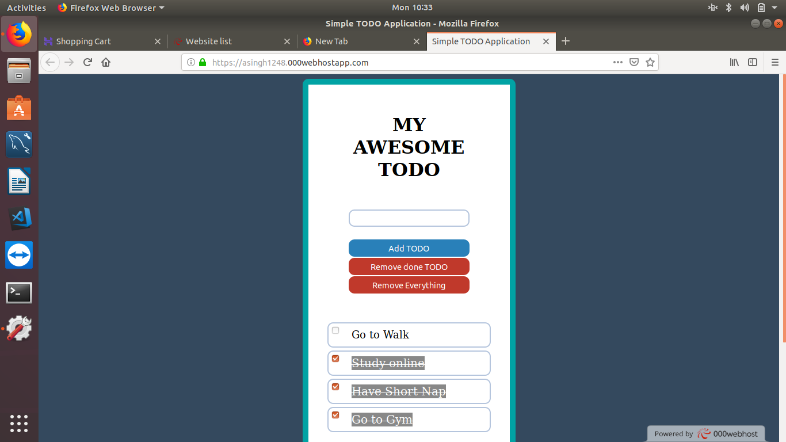
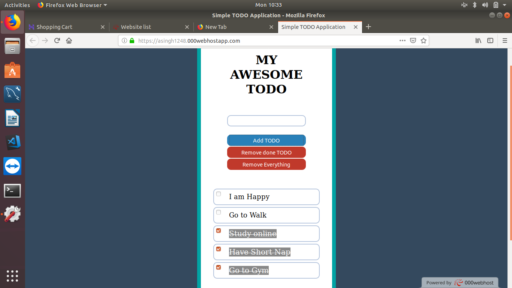
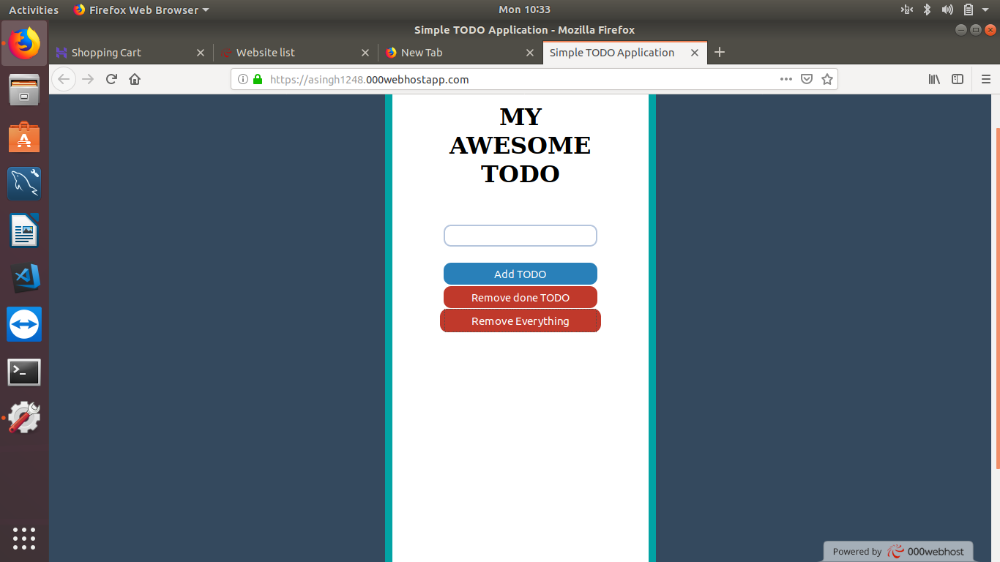

# MyTodoApp

<div>
<br> 

>Its a Todo App in Javascript developed at http://asingh1248.000webhostapp.com/ for use
</div>
<ul>
<li>One can Enter his Todo List</li>
<li>Mark it has been done </li>
<li>Remove all done Todo's </li>
<li>Clear All the list </li>
</ul>

---------------------------------
<h4>Tech Stack </h4>
<ul>
<li>HTML,CSS </li>
<li>Javascript for the Client Side Processing(DOM Maniplutaion)</li>
</ul>

-----------------------------------
### Installation

* Clone the Project
```sh
    $ git clone https://github.com/Asingh1248/MyTodoApp.git
```
```sh
    link http://asingh1248.000webhostapp.com/
````
-----------------------------------------
### ScreenShot
<div align=center>
    
    
    
    
 </div> 
    
    
